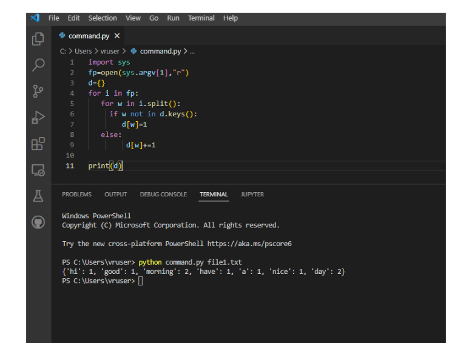

# command-line-arguments-to-count-word
## AIM:
To write a python program for getting the word count from the contents of a file using command line arguments.
## EQUIPEMENT'S REQUIRED: 
PC
Anaconda - Python 3.7
## ALGORITHM: 
### Step 1:
Recieve the input.

### Step 2: 
Read through the lines.
 
### Step 3: 
Count the words.

### Step 4:  
Write the code.

### Step 5: 
Execute the code.

### Step 6: 
Recieve the output.

## PROGRAM:
```python
'''
Developed by: Vishnupriya R
Reference number: 22006962
'''

import sys
count={ }
with open (sys.argv[1],'r') as f:
  for line in f:
    for word in line.split():
      if word not in count:
        count[word]=1
      else:
        count[word]+=1
print(count)
f.close()
```

### OUTPUT:



## RESULT:
Thus the program is written to find the word count from the contents of a file using command line arguments.
